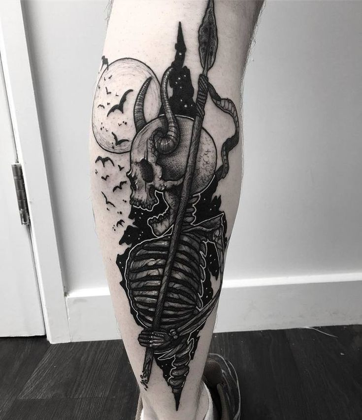
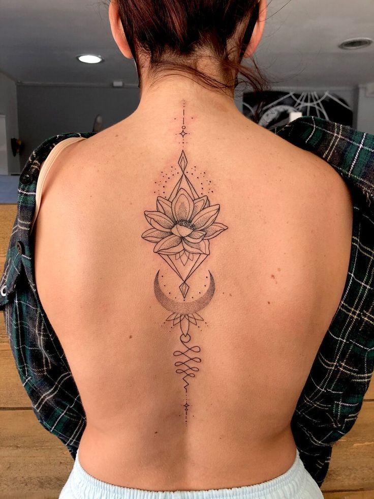
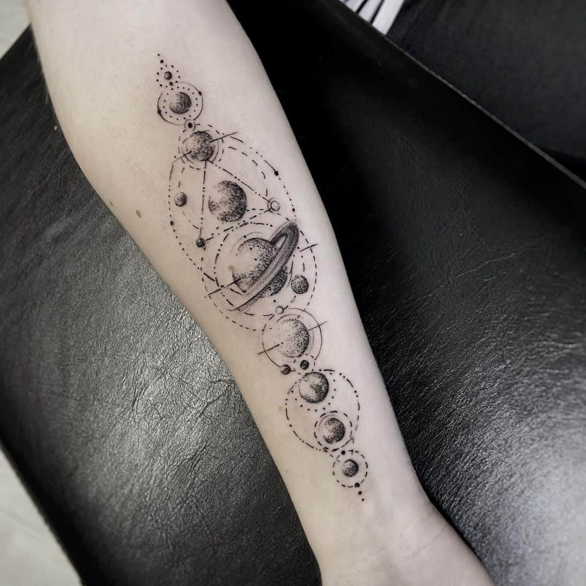
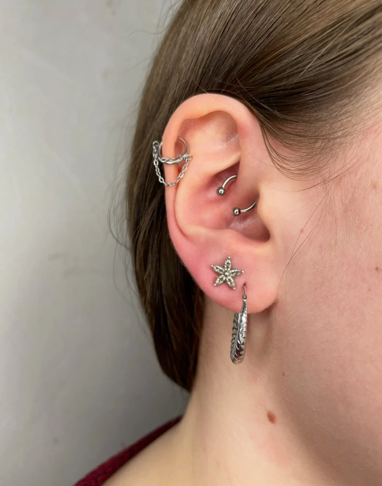
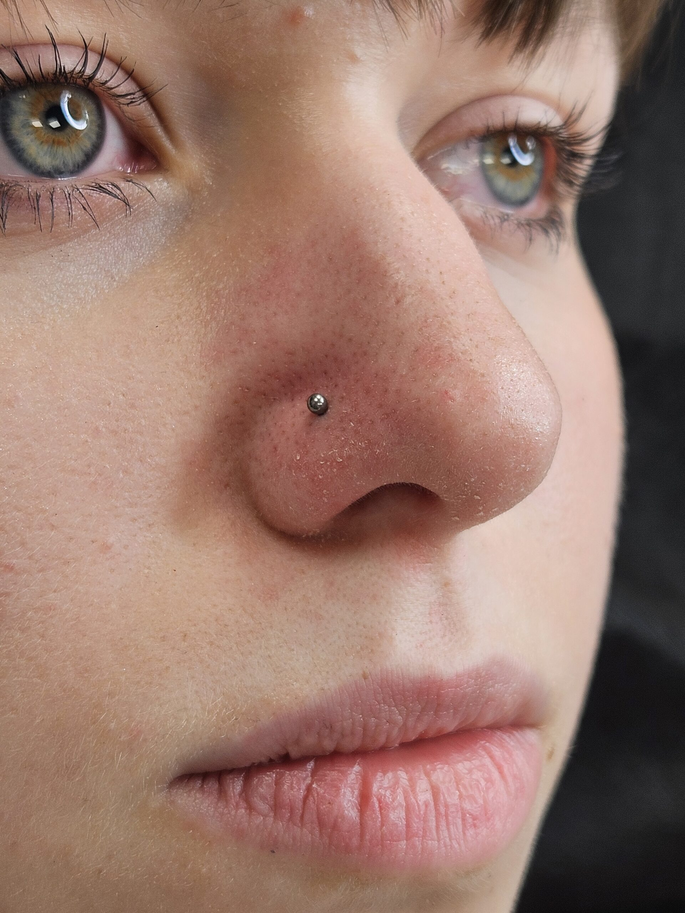
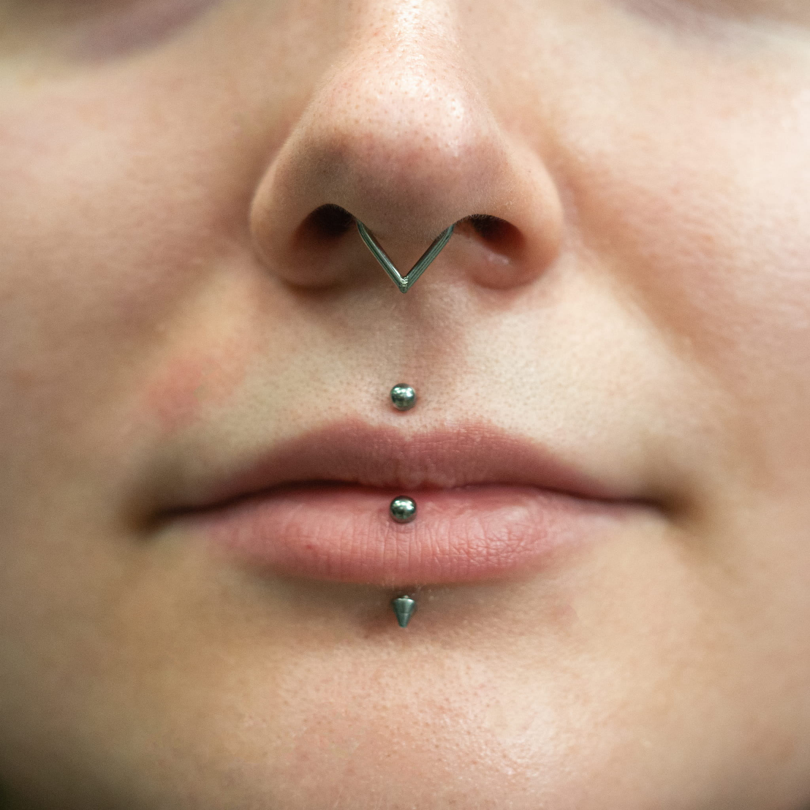

# MANTRA-TATTOO-PIERCING
MANTRA TATTOO &amp; PIERCING
<!DOCTYPE html>
<html lang="pl">
<head>
    <meta charset="UTF-8">
    <meta name="viewport" content="width=device-width, initial-scale=1.0">
    <title>MANTRA TATTOO & PIERCING | TATTOO & PIERCING</title>
    
    <link href="https://unpkg.com/aos@2.3.1/dist/aos.css" rel="stylesheet">
    <link rel="stylesheet" href="https://cdn.jsdelivr.net/npm/swiper@11/swiper-bundle.min.css" />
    
    
</head>
<body>

    <nav>
        

            <a href="#" class="nav-home">☥</a>
            <a href="#historia">O nas</a>
            <a href="#ekipa">Artyści</a>
            <a href="#galeria">Galeria</a>
            <a href="#cennik">Cennik</a>
            <a href="#regulamin">Regulamin</a>
            <a href="#newsletter">Zapisy</a>
            <a href="#kontakt">Kontakt</a>
        

    </nav>

    <header style="text-align: center; padding: 120px 30px 60px;">
        <h1 style="font-family: 'Cinzel'; font-size: clamp(3rem, 10vw, 5rem); margin: 0 0 20px 0; letter-spacing: 20px; color: #fff; text-shadow: 0 0 15px rgba(255,255,255,0.1);">MANTRA TATTOO & PIERCING</h1>
        
✥

        
Sztuka wpisana w ciało

    </header>

    <section id="historia">
        <h2 data-aos="fade-up">HISTORIA</h2>
        
♰

        

            
MANTRA TATTOO & PIERCING powstał w 2026 roku z potrzeby zjednoczenia artystów, dla których tatuaż i piercing to nie tylko rzemiosło, ale rytuał. Nasze progi przekraczają ci, którzy szukają autentyczności, mroku i precyzji w każdym detalu. Stworzyliśmy azyl z dala od zgiełku miasta i masowej kultury. Tutaj czas płynie inaczej. W ciszy i skupieniu, przy akompaniamencie maszyn, zamieniamy Twoje wizje w trwałą sztukę, nie uznając kompromisów w jakości.

        

    </section>

    <section id="ekipa">
        <h2 data-aos="fade-up">ARTYŚCI</h2>
        
☩

        

            

                

                

                <h3>Kornel</h3>
                
Blackwork / Dark Art

            

            

                

                

                <h3>Lidia</h3>
                
Ornamental / Dotwork

            

            

                

                

                <h3>Wiktor</h3>
                
Realizm Czarno-Szary

            

            

                

                

                <h3>Blanka</h3>
                
Fine Line / Sketch

            

            

                

                

                <h3>Malwina</h3>
                
Master Piercer

            

        

    </section>

    <section id="galeria">
        <h2 data-aos="fade-up">GALERIA</h2>
        
✦

        

            

            

            

            

            

            

            

            

            

            

            

            

        

    </section>

    <section id="cennik">
        <h2 data-aos="fade-up">CENNIK</h2>
        
♄

        

            

                

                    

                        

                        <h3>USZY</h3>
                        
Lobe80-140 zł

                        
Helix120-200 zł

                        
Tragus140-250 zł

                        
Industrial180-250 zł

                    

                

                

                    

                        

                        <h3>NOS / TWARZ</h3>
                        
Nostril120-200 zł

                        
Septum140-260 zł

                        
Medusa150-270 zł

                        
Eyebrow130-220 zł

                    

                

                

                    

                        

                        <h3>INTYMNE</h3>
                        
Christina200-350 zł

                        
VCH / HCH180-320 zł

                        
Prince Albert200-370 zł

                    

                

                

                    

                        

                        <h3>DODATKI</h3>
                        
Wymiana30-60 zł

                        
Konsultacjagratis

                        
Kontrolagratis

                    

                

            

            

            

        

    </section>

   <section id="regulamin">
    <h2 data-aos="fade-up" style="font-size: 2.8rem; margin-bottom: 20px;">REGULAMIN</h2>
    
⚖

    

        
        

        

        

        

        
        <ul style="list-style: none; padding: 0; text-align: left; font-size: 1.3rem; line-height: 1.8; color: #e3d5b8;">
            <li style="margin-bottom: 25px; border-bottom: 1px solid rgba(175, 148, 77, 0.15); padding-bottom: 15px;">
                ✦ Postanowienia Ogólne: 
                Studio zapewnia najwyższy standard sterylności i higieny. Przystąpienie do zabiegu oznacza pełną akceptację regulaminu oraz pisemne oświadczenie o stanie zdrowia.
            </li>
            
            <li style="margin-bottom: 25px; border-bottom: 1px solid rgba(175, 148, 77, 0.15); padding-bottom: 15px;">
                ✦ Wiek i Zgody: 
                Osoby niepełnoletnie (16+) muszą stawić się z rodzicem lub opiekunem prawnym. Przekłucia intymne oraz modyfikacje zaawansowane wykonujemy wyłącznie osobom pełnoletnim (18+).
            </li>
            
            <li style="margin-bottom: 25px; border-bottom: 1px solid rgba(175, 148, 77, 0.15); padding-bottom: 15px;">
                ✦ Rezerwacja: 
                Rezerwacja terminu wiąże się z wpłatą zadatku. Zadatek jest potwierdzeniem rezerwacji i akceptacją zasad pracy studia.
            </li>

            <li style="margin-bottom: 10px;">
                ✦ Bezpieczeństwo: 
                Obowiązuje całkowity zakaz spożywania alkoholu i środków psychoaktywnych przed wizytą. Studio ma prawo odmówić obsługi osób pod wpływem.
            </li>
        </ul>
    

</section>

    <section id="newsletter" style="text-align: center;">
        <h2 data-aos="fade-up">ZAPISY</h2>
        
✉

        

            <input type="email" class="newsletter-input" placeholder="WPISZ TWÓJ E-MAIL">
             
            <button class="submit-btn">WYŚLIJ FORMULARZ</button>
        

    </section>

    <section id="kontakt" style="text-align: center; border-top: 1px solid rgba(175,148,77,0.1);">
        <h2 data-aos="fade-up">KONTAKT</h2>
        
UL. MISTYCZNA 13, WARSZAWA

        
IG: @MANTRA_TATTOO&PIERCING

        
TEL: +48 000 000 000

    </section>

    <footer>
        
© 2026 MANTRA_TATTOO&PIERCING | ALL RIGHTS RESERVED

    </footer>

    
    
    
   

</body>
</html>
